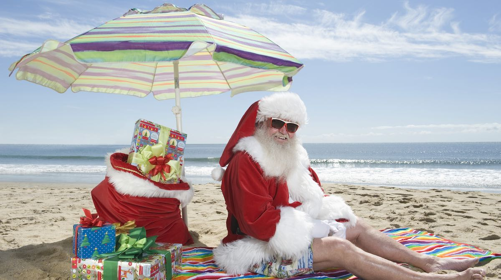

# Welcome to Australia

## Australia is very far away from Latvia, almost on the other side of the world. 

- Sydney, the biggest city in Australia is approximately 15,000 Kilometers away from Riga 
- To get to Australia would take one day in an airplane

## Australia is a very big country.

- Australia is the world's biggest island
- Latvia could fit into Australia 120 times. 
- Australia is mostly desert
- Most people live in the green areas in cities.
- There are 25 million people in Australia. This is approximately 15 times more people than in Latvia, but still a small number of people compared to how big Australia is.

## Climate

Even though Australia is mostly Desert there are many different climates to be found in Australia

We have:

###Snow

###Mountains

###Desert

###Tropical Rainforest

### Coral Reefs

And much more

I am from a place called Cairns and there it is tropical. 
[Google street view](https://goo.gl/maps/dnkMKbDFGKWau7Xq6)
In Cairns are rainforests, coral reefs, and tropical islands. It is very different to other places in Australia. Cairns is also a sister city of Riga.
(photos)

## Animals

Australia is an island, seperated from the rest of the world, and so it has many unusual animals which are only found in Australia. Some of these animals include:

- Kangaroo

- Koala

- Emu

- Echidna

- Wombat

- Platypus

- Frill Necked Lizard

- Cassowary

- Tasmanian Devil

- Sugar Glider

- Kookaburra

## Christmas

In Australia, Christmastime happens in the middle of Summer. Also, there are no reindeer in Australia. So in Australia, Santa Claus uses Kangaroos to deliver presents.

It is usual for families in Australia to have a barbeque at the beach for Christmas. 

## Aboriginals

The first people in Australia are known as Aboriginals. They have a very unique culture with lots of different languages, stories, and music. 

One aboriginal musical instrument is called the didgeridoo, it sounds like this:

### Didgeridoo

[https://www.youtube.com/watch?v=yG9ZX1FS20A](https://www.youtube.com/watch?v=_b-vI3Nf50g)

(picture)

The didgeridoo is mostly made by nature. The people would walk through the forest and knock on tree trunks until they found one which was hollow. Then
they would cut down the tree and dry it, and then painted or carved. The sound, or "voice" of the didgeridoo is thought to be the spirit of the tree.

To play the didgeridoo, you do not simply blow air into it, instead you make a buzzing sound with your lips. 

### Aboriginal stories

In Aboriginal tradition, the Didgeridoo was a very important traditional instrument and used to share stories. The sounds of a didgeridoo can imitate the
sounds of an animal, or nature, or some event. There are very many aboriginal stories and often they are shared through songs. One of those stories is about 
Tidalik the frog, who drank all the water in the world

https://www.bbc.co.uk/teach/school-radio/english-ks1-tiddalik-the-frog-part-1

## Demonstrations

- Fairy bread
- Handball

